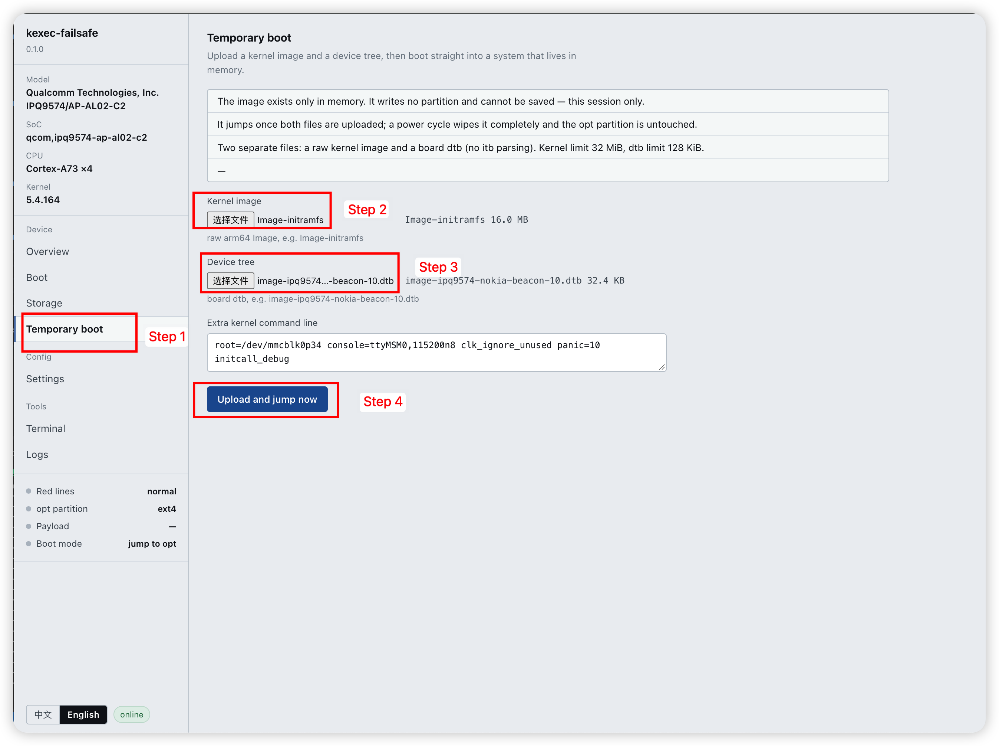
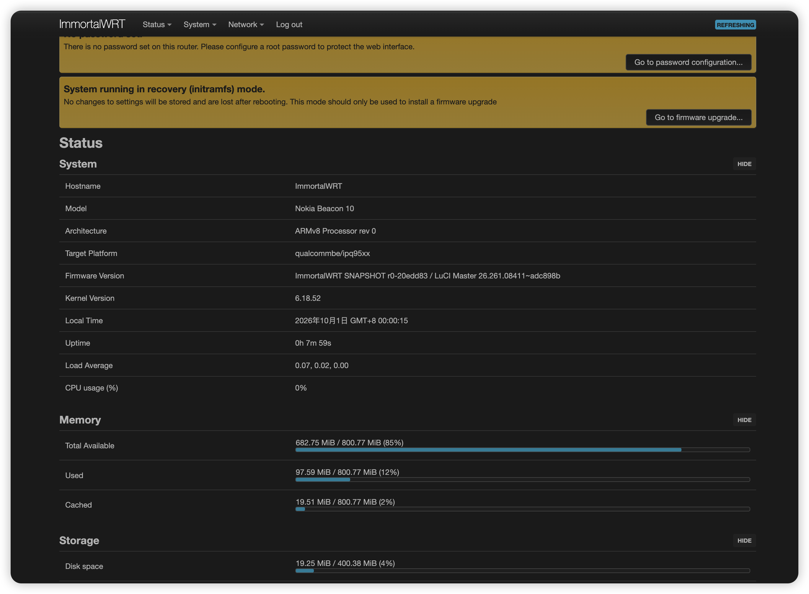

# Disclaimer

This project is still experimental. Apart from temporary boot, none of the other features
have been verified, and all of them are 100% guaranteed to have problems. If using this test
project damages your device, I accept no responsibility whatsoever.

# kexec-handover

Run your own kernel on a router the vendor has locked down with Secure Boot.

A Secure Boot signature check only covers the boot chain up to the moment HLOS starts. Once
a kernel is up and running, the verified boundary is behind you. So instead of taking the
signatures on head-on, this project **never touches the boot chain at all**: at runtime it
uses `kexec` to swap out the running kernel. Nothing is ever written to a boot slot.

Verified on the Nokia Beacon 10 (Qualcomm IPQ9574).

The intended jump flow:

1. `/configs/pre_app_boot.sh` starts `boot.sh` from `kexec-failsafe`;
2. `boot.sh` checks the current mode; three modes are supported: `jump to the new system`,
   `stay on the stock system for this boot`, `always stay on the stock system`;
3. `boot.sh` blinks the WPS LED to open a window; pressing the WPS button within that window
   drops into failsafe, a recovery console with a web UI;
4. from failsafe you can flash a new system, view logs, run terminal commands, or jump into
   the initramfs.

## Directory layout

| path | what it is |
|---|---|
| `kexec/` | **The handover core.** `kjump` is a freestanding (libc-free) aarch64 userspace program: it parses the kernel image, fixes up the bootargs in the device tree, syncs, takes the secondary CPUs offline, loads a small kernel module, then hands over. The module itself lives here too, and nothing in this directory is specific to any one board. |
| `build-imm-initramfs/` | **Builds the initramfs kernel.** Produces a minimal ImmortalWrt kernel with an embedded initramfs — plus a rootfs overlay, a patch series and config overrides — yielding a bare kernel and the board dtb. |
| `kexec-failsafe/` | **Web console.** A self-contained web UI served by thttpd on port 1717, backed by shell CGIs: upload a kernel image + device tree and jump to it, flash or wipe the `opt` partition, open a shell, view logs. Its build produces both the kexec core and the web console. |

Each directory has its own `README.md` covering the build environment, dependency install,
build steps, and artifact paths.

### `immortalwrt` is a submodule; the board delta is a patch series

`immortalwrt/` is a git submodule pinned to the upstream commit this project is based on
(`20edd83`, `VIKINGYFY/immortalwrt`):

```
git submodule update --init --recursive
```

At build time the patches are applied with `git apply` onto a clean submodule checkout and
reverted when the build ends. This keeps the delta visible and reviewable, and makes
rebasing mechanical: rebase the patch series onto a new upstream commit, bump the submodule
pointer, done.

## Building

### kexec-failsafe — kexec core + web console

The module builds two kernel trees: linux-4.14 was used for QEMU emulation during
development and has not been removed from the code; linux-5.4 matches the kernel version of
the Beacon 10 stock firmware.

```
export KERNEL_TREE_54=/path/to/configured/linux-5.4
export KERNEL_TREE_414=/path/to/configured/linux-4.14
bash kexec-failsafe/build.sh
```

Produces under `kexec-failsafe/dist/`:

- `kexec-failsafe-<version>.tar.gz` — a directly deployable package
- `kexec-failsafe-<version>/` — unpacked:
  - `kexec/` — `kjump`, `kexec-lite-54.ko`, `kexec-lite-414.ko`
  - `failsafe/` — the web console (`start.sh`, `lib/`, `www/`, `bin/thttpd`, `bin/busybox`)

Common environment variables: `XGCC`, `KEXEC_DIR`, `KEXEC_DIST`, `THTTPD_SRC`, `BUSYBOX_SRC`,
`SKIP_KEXEC_BUILD=1` (package an existing kexec build instead of rebuilding it).

### build-imm-initramfs — kernel image + device tree

```
bash build-imm-initramfs/build.sh /path/to/immortalwrt
```

Produces under `build-imm-initramfs/dist/`:

- `Image-initramfs` — bare arm64 kernel with the initramfs embedded
- `image-ipq9574-nokia-beacon-10.dtb` — board device tree
- `SHA256SUMS`

Everything the build applies to the source tree is reverted when it finishes.

### Building kexec on its own

```
cd kexec
bash build.sh [all|kjump|module-414|module-54|test|clean]
```

`test` runs the host-side parser tests; it needs neither a cross compiler nor a kernel tree.

## How it works

The three pieces are orthogonal — each is useful on its own:

- **Handover** answers "how do you replace a running kernel without touching the boot
  chain?". It is a generic tool; nothing in `kexec/` holds only for one particular board.
- **The board port** answers "how do you get upstream OpenWrt to support this board, with a
  delta that stays visible and can keep up with upstream?".
- **Reproducible builds** answer "why should anyone believe an image you published was built
  from this source?".

The original vision was to prove that a locked-down device can be made genuinely open
without attacking the lock: accept that the signature chain cannot be broken, and operate
only where it does not reach. That is why nothing here ever writes a boot slot, an
environment variable, or a fuse.

## Current status

- **Handover works on real hardware** — verified jumping into a self-built initramfs.
- **Web console, working features** — upload an initramfs kernel + device tree and jump;
  interactive terminal; log viewer; red-line self-checks.
- **Deploy to `/tmp` only** — do not deploy to `/configs`.

## Limitations

- **Only the initramfs can boot today.** The resident `opt`-partition boot path is still
  under development;
- **thttpd kills any CGI after 30 seconds** (a compile-time constant of thttpd itself);
- **The web console has no authentication.** Do not expose it to an untrusted network;
- **Verified on my own board only.**

## Notes

- `kexec-failsafe/bin/thttpd` is cross-compiled and statically linked. The stock `thttpd`
  loads `libsec_engine.so`, which blocks `insmod` outright.
- `kexec-failsafe/bin/busybox` is a statically linked busybox (GPL-2.0). The stock `rootfs`
  ships without `od`, `blockdev`, or `timeout`.

## Quick test

1. Upload `kexec-handover/kexec-failsafe/dist/kexec-failsafe-0.1.0.tar.gz` to `/tmp` on the
   Beacon 10;
2. Unpack: `cd /tmp && tar -zxvf /tmp/kexec-failsafe-0.1.0.tar.gz`;
3. Allow port 1717: `iptables -I INPUT 1 -i br+ -p tcp --dport 1717 -j ACCEPT && /etc/init.d/firewall reload`
4. Start the web console: `sh /tmp/kexec-failsafe-0.1.0/failsafe/start.sh -f`;
5. Open `192.168.12.1:1717` in a browser — adjust if your Beacon 10 LAN address differs;
6. Open **Temporary boot** → upload `kexec-handover/build-imm-initramfs/dist/Image-initramfs`
   → upload `kexec-handover/build-imm-initramfs/dist/image-ipq9574-nokia-beacon-10.dtb` →
   click **Upload and jump now**. TIP: if the router has been up for a long time and memory
   is heavily fragmented, the kernel image may fail to load — a reboot fixes it.
7. Wait 30 seconds, verify that OpenWrt has taken over and that SSH is reachable (no
   password needed): `ssh -o StrictHostKeyChecking=off root@192.168.1.1`;


